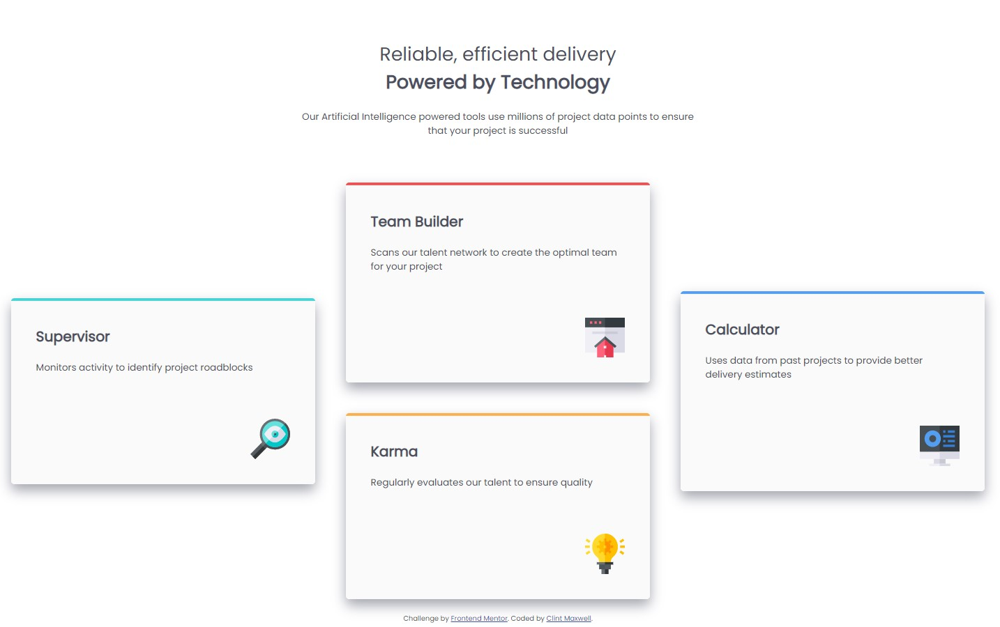

# Frontend Mentor - Four card feature section solution

This is a solution to the [Four card feature section challenge on Frontend Mentor](https://www.frontendmentor.io/challenges/four-card-feature-section-weK1eFYK). Frontend Mentor challenges help you improve your coding skills by building realistic projects. 

## Table of contents

- [Overview](#overview)
  - [The challenge](#the-challenge)
  - [Screenshot](#screenshot)
  - [Links](#links)
- [My process](#my-process)
  - [Built with](#built-with)
  - [What I learned](#what-i-learned)
  - [Continued development](#continued-development)
  - [Useful resources](#useful-resources)
- [Author](#author)
- [Acknowledgments](#acknowledgments)


## Overview

### The challenge

Users should be able to:

- View the optimal layout for the site depending on their device's screen size

### Screenshot
#### Desktop Version


#### Mobile Version (top and bottom)


### Links

- Live Site URL: [Four Card Feature Section Project](https://antoniohoutx.github.io/four-card-feature-section/index.html)

## My process

### Built with

- Semantic HTML5 markup
- CSS custom properties
- Flexbox
- CSS Grid
- Mobile-first workflow
### What I learned

While working on this project, one of the primary things I learned was combining CSS Grid with CSS Flexbox.  This allowed me to style the cards as a grid, and the content within each card as a flexbox, as shown in the two code snippets below:

To see how you can add code snippets, see below:


```css
.cards {
    margin: auto auto auto auto;
    display: grid;
    grid-template-columns: 1fr 1fr 1fr;
    grid-template-rows: auto auto auto auto;
    gap: 2rem;
    align-items: center;
    justify-content: center;
  }
```

```css
.text {
    display: flex;
    align-items: flex-start;
    justify-content: left;
    flex-direction: column;
  }

  .pic {
    display: flex;
    align-items: flex-end;
    justify-content: flex-end;
  }
```
### Continued development

Some concepts that I'm still not comfortable with include absolute vs. relative filepath references in the href attribute.  Also, I need to better fine-tune the media queries pixel resolution breakpoints in order to make my web design more responsive based on device.  Finally, I need to work on refining my grasp of CSS selectors.

### Useful resources

- [Learn Flexbox in 20 Minutes](https://www.youtube.com/watch?v=FTlczfR82mQ) - This helped me grasp the fundamental concepts of CSS Flexbox.
- [CSS border-top Property](https://www.w3schools.com/cssref/pr_border-top.asp) - This helped me to better understand the border-top property so that I could a colored border in each of the cards.

## Author

- LinkedIn - [Clint Maxwell](https://www.linkedin.com/in/maxwellclint/)
- Twitter - [@clintmaxwell](https://www.twitter.com/clintmaxwell)

## Acknowledgments

I'd like to thank the wonderful people in the Slack community for their assistance on this challenge.  Once again, I'd also like to especially thank [Drull](https://github.com/drull1000) for his patience and diligence in helping a out an HTML/CSS newbie.
